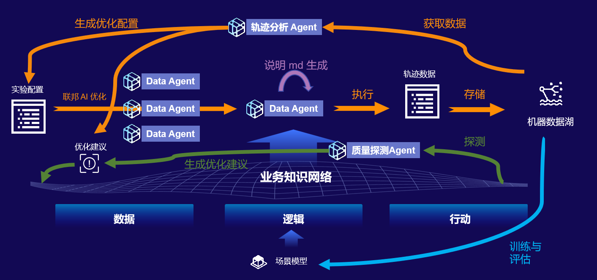
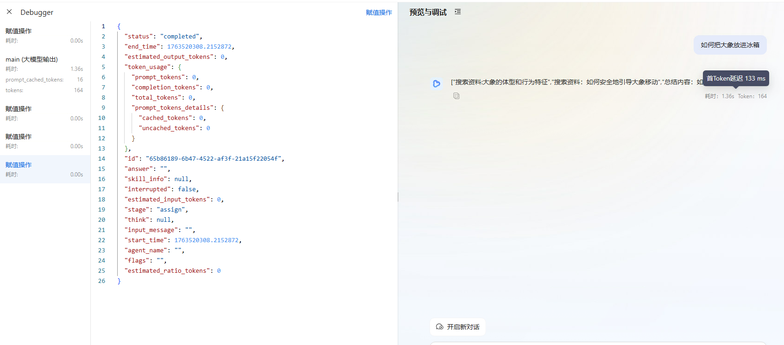

# AI Agent Observability & Quality Optimization

## 1. 背景（Background）

随着 AI Agent 在企业内部快速普及，系统对 性能稳定性、质量可控性、成本可控性、用户体验 的要求日益提高。
然而当前 Agent 系统普遍存在：

运行链路不透明（看不到模型执行/工具调用/上下文流转）

无法定位质量问题（错误不知道发生在哪里）

用户体验不可量化（满意度与成功率无法自动评估）

缺乏优化闭环（没有智能优化建议）

### ❌ 1. 可观测能力弱

无法知道 Agent 为什么慢

工具调用链路不可见

错误原因不明确

### ❌ 2. 用户体验无法量化

用户到底满意还是不满意？

多轮对话是否高效？

用户会话为什么突然中断？

### ❌ 3. 质量问题无自动化检测

幻觉识别靠人工

回答逻辑错误无检测

工具参数错误无人警告

### ❌ 4. 缺乏自动优化建议

不知道应该修改 Prompt？

还是应该调整工具？

或者应该增强知识库？

因此需要构建一套统一的 Agent Observability（可观测）与 Quality Insights（质量分析/优化建议） 能力。


## 2. 愿景（Vision）

构建 从上到下清晰、有指标、有链路、有分析、有建议 的 Agent 可观测和质量分析能力，实现：

- ✔ 每一次执行都可以追踪
- ✔ 每一次质量问题都能自动识别
- ✔ 每一次低质量表现都能给出优化建议
- ✔ 每个 Agent 都有可衡量的“健康状态”
- ✔ 每个对话的用户体验可以量化
- ✔ 最终实现自我优化、自我诊断的智能体系统

## 3. 关键目标（Key Goals）

Agent在运行一段时间后，期望可以结合以下信息对Agent的配置或提示词自动调优，以使Agent达成最好的效果，同时，也可以基于过去一段时间内的Agent运行时进行运维分析与trace链路等分析

整体目标划分为两个主方向：
### 🎯 目标 1：Agent 可观测（Observability）

1. 建立三层级可观测体系
    - Agent
    - Session
    - Run（含 完整 Progress 链路）

2. 对 Agent 多维度监控
    - 请求量
    - 成功率
    - 工具调用情况
    - 时延
    - 错误原因
    - ....

3. 完整链路透明化

可看到：
```
输入 → 模型 → 推理 → 工具 → 再推理 → 最终输出

```

4. 可视化 Dashboard
    - Agent 总览
    - Session 详情
    - Run Trace


### 🎯 目标 2：Agent 质量分析 & 优化建议（Quality Insights）
1. 自动质量检测
    - 逻辑错误
    - 信息不一致
    - 无关回答
    - 工具错误
    - 用户挫败感征兆

2. 用户体验自动评估
    - 用户满意度（显式/隐式）
    - Session 完整性
    - 对话轮数效率

3. 优化建议生成

从以下角度给出 actionable insights：

    - Prompt 提示词优化
    - 工具调用优化
    - 知识库补充建议
    - Agent 任务结构调整


## 4. 核心概念与对象模型（Key Concepts）

需要统一定义四个层级：
```
Agent → Session → Run →  Progress
```
用于从高层聚合 → 低层诊断。

### 4.1 Agent（智能体）

一个 Agent 实例（如客服 Agent、旅行规划 Agent）。

生命周期：长期存在，多个用户共享。

一个 Agent = 多个 Session 的父对象

### 4.2 Session （一次完整对话）

Session 是用户与 Agent 的 完整交互生命周期。

生命周期：从用户发送第一条消息 → 本轮对话结束。

Session 触发条件：

- 用户发送第一条消息（启动）
- 一段时间无活动（自动结束）
- 用户主动结束（如点击“结束对话”）
- 系统判断任务已完成

### 4.3 Run （一次问答）

Run = 用户的一次提问 + Agent 的一次回答,是 Session 最小可观测单元。

每个 Run 可能包含多个 Span（如工具调用）。

### 4.4 Progress（执行链路）
Span 用于描述 Agent 执行链路中的细节步骤，类似 OpenTelemetry。


## 5. 产品能力拆解（Two Core Capabilities）
- 能力 1：**Agent 可观测（Observability）**： 基于 Agent → Session → Run → Progresses 四个层级逐级展开。
- 能力 2：**Agent 质量分析 & 优化建议（Quality Insights）**：对三大维度执行分析 → 生成可执行的优化建议。

## 6. 功能一：Agent 可观测能力设计（核心）

### 6.1 可观测体系结构（Observability Model）
AI Agent Observability 模型包含：

- Metrics（数值指标）
- Traces（链路追踪）
- Logs（文本日志事件）

三者结合构成一个完整可观测系统。

#### 6.1.1 Metrics（指标）

用于统计整体情况，回答：

- 是否变慢？
- 是否成功率下降？
- 工具错误是否增加？

Metrics 按照三层级提供：

- Agent 级指标
- Session 级指标
- Run 级指标

#### 6.1.2 Traces（链路追踪）
Traces 解决：

- Agent 过程是什么？
- 调用了哪些工具？
- 工具失败在哪里？

#### 6.1.3 Logs（事件日志）

记录关键事件：

- tool.failed
- model.failed
- session.ended
- retry.triggered

### 6.2 Metrics（指标）

#### 6.2.1 Agent 级可观测（Global / Aggregated Metrics）

| 指标名称（英文） | 中文名 | 描述 | 单位 | 维度属性 |
|------------------|--------|------|------|----------|
| Total Requests(√) | 总请求数 | Agent 累计处理的用户请求总次数 | 次 | 全局/聚合指标 |
| Unique Users | 独立用户数 | 发起请求的 distinct 用户总数 | 个 | 全局/聚合指标 |
| Total Sessions (√)| 总会话数 | Agent 完成的完整用户会话总次数（通常以用户会话结束或超时界定） | 个 | 全局/聚合指标 |
| Avg Session Rounds  (√) | 平均会话轮次 | 所有会话的平均交互轮数（每轮为一次用户请求+Agent响应） | 轮/会话 | 全局/聚合指标 |
| Run Success Rate  (√)| 任务成功率 | 成功完成 Run 的请求/会话占比（需结合业务场景定义“成功”） | % | 全局/聚合指标 |
| Agent Crash Rate | Agent 崩溃率 | Agent 运行过程中发生崩溃的请求/会话占比 | % | 全局/聚合指标 |
| Avg Execute Duration  (√)| 平均执行耗时 | 分别代表 50%/90%/99% 的请求响应时间处于该数值以下，反映响应速度分布 | ms（毫秒） | 全局/聚合指标 |
| Avg TTFT Duration  (√)| 平均首 Token 响应耗时 | 从用户发起请求到收到 Agent 首次有效响应的平均时间，衡量首屏加载体验 | ms（毫秒） | 全局/聚合指标 |
| Tool Success Rate (√)| 工具成功率 | Agent 调用外部工具时执行成功的请求占比（如工具超时、返回错误结果等） | % | 全局/聚合指标 |
| Cost per Request | 单次请求成本 | 处理单个用户请求的平均资源/资金成本（如算力、API 费用等） | 元（或对应货币单位） | 全局/聚合指标 |
| Cost per Session | 单会话成本 | 处理单个完整会话的平均资源/资金成本（如算力、API 费用等） | 元（或对应货币单位） | 全局/聚合指标 |
| Request Trend (Hourly/Daily) | 请求趋势（小时/天） | 按小时或天维度统计的请求数变化趋势，反映流量波动 | 次/小时 或 次/天 | 趋势指标 |
| Success Rate Trend | 成功率趋势 | 按时间维度（小时/天）统计的任务成功率变化趋势 | %/小时 或 %/天 | 趋势指标 |
| Error Rate Trend | 错误率趋势 | 按时间维度（小时/天）统计的各类错误（含崩溃、工具失败等）占比变化趋势 | %/小时 或 %/天 | 趋势指标 |
| Tool Fail Rate Trend | 工具失败趋势 | 按时间维度（小时/天）统计的工具调用失败率变化趋势 | %/小时 或 %/天 | 趋势指标 |
| Agent Response Time Trend | Agent响应时间趋势 | 按时间维度（小时/天）统计的平均响应时间（或 p50/p90/p99）变化趋势 | ms/小时 或 ms/天 | 趋势指标 |


#### 6.2.2 Session 级可观测（Conversation-level）
| 指标名称（英文） | 中文名 | 描述 | 单位 | 维度属性 |
|------------------|--------|------|------|----------|
| Session Run Count (√)| 会话总轮数 | 单个会话中用户请求与Agent响应的总交互轮次 | 轮 | 会话维度指标 |
| Session Duration (√)| 会话时长 | 从会话启动到结束（或超时）的总时间跨度 | ms（毫秒）/ min（分钟） | 会话维度指标 |
| Session Status | 任务状态 | 会话对应的用户任务最终状态，包含成功、失败、用户放弃、超时四类 | 枚举值（Success/Failed/Abandoned/Timeout） | 会话/任务维度指标 |
| Avg Run Execute Duration (√) | 平均执行耗时	 | 单个会话所有 Run 的平均响应耗时（不含分位数，仅平均值） | ms（毫秒） | 全局/会话维度指标 |
| Avg Run TTFT Duration  (√)| 平均首 Token 响应耗时 | 单个会话所有 Run 的首次有效响应的平均时间，衡量首屏加载体验 | ms（毫秒） | 全局/聚合指标 |
| Run Error Count(√) | Run错误次数 | Session 中 Run 失败的总次数 | 次 | 全局/会话维度指标 |
| Tool Fail Count(√) | 工具错误次数 | Agent在会话（或全局）中调用外部工具时发生失败的总次数 | 次 | 全局/会话维度指标 |
| Cost  | 单会话成本 | 处理单个完整会话的总资源/资金成本（单次请求成本×会话总轮数，含固定成本分摊） | 元（或对应货币单位） | 全局/会话维度指标 |
| Cost per Request | 单次请求成本 | 处理单个用户请求的平均资源/资金成本（含模型调用、工具调用、算力等费用） | 元（或对应货币单位） | 全局/请求维度指标 |


#### 6.2.3 Run 级可观测（Execution Unit）

Run 是最细粒度，也是链路追踪的核心。

##### Run 元数据

- Input Message

- Output Message

- Model Used（with tokens）

- Response Time（模型 & 工具）

- Token 输入/输出

- Tools Invoked（按顺序）

##### Progress 结构

每个 Run 包含完整路径：

```
============================================================
    Dolphin Runtime Call Chain - Execution Time: 31.30s    
============================================================
 🤖 Agent[deepsearch]
  ├─ 📦 Block[AssignBlock]
    ├─ ⚡ Progress[6505decc] (1 stages)
      ├─ 🔄 Stage[TypeStage.ASSIGN] - Status.COMPLETED
  ├─ 📦 Block[ExploreBlock]
    ├─ ⚡ Progress[f90992d8] (19 stages)
      ├─ 🔄 Stage[TypeStage.LLM] - Status.COMPLETED
      ├─ 🔄 Stage[TypeStage.SKILL] - Status.PROCESSING
      ├─ 🔄 Stage[TypeStage.LLM] - Status.COMPLETED
============================================================
Total instances: 25
Summary: 1 Agents, 2 Blocks, 2 Progresses, 20 Stages
============================================================
```
详细的链路属性和指标参数当前debug progress 的实现：


## 7. 功能二：Agent 质量分析 & 优化建议（Quality Insights）

基于三层级执行质量分析
### 7.1 输入
结构化 Agent 运行数据，来自可观测系统的数据（Agent → Session → Run）

示例
```
{
  "agent": {...},
  "session": {...},
  "runs": [
    { "run_id": "...", "proresses": [...], ... }
  ],
  "metrics": {
    "task_success_rate": 0.7,
    "avg_latency": 1.2,
    "tool_failed_rate": 0.15,
    "hallucination_risk": 0.3,
    "implicit_satisfaction_score": 0.8
  }
}

```

### 7.2 分析逻辑

#### 7.2.1 用户体验分析
**目标**

基于显式 + 隐式信号判断用户对话体验，识别挫败/满意/疑惑等问题并给出改进方向。

**主要输入**

- conversation/sesison:rounds, duration, first_success_turn, completion_status
- user_behavior: reask_count, retry_count, clarification_count, user_interrupt, abandon, thumbs_up/down, sentiment (NLP)
- run-level: latency, tool errors in run, self_correction_count; 
- explicit feedback (stars, text) 

**输出**

用户体验分析 && 改进建议

#### 7.2.2 质量分析

**目标**

识别事实错误、逻辑矛盾、知识库冲突、幻觉、错误引用等“正确性”问题。

**主要输入**

- run/progress outputs, tool responses,  user corrections

**输出**

错误分析 && 错误修复建议

#### 7.2.3 性能分析

**目标**

发现延迟源（模型/工具/network）、超时、重试滥用，给出减少用户感知延迟的建议。

**主要输入**

- span latency breakdown: model_latency ，tool_latency, network_latency
- run/session level: avg_run_latency, p95_latency, p99_latency

**输出**

性能瓶颈分析 & 改进建议 

#### 7.2.4 成本分析

**目标**

检测高成本模式（不必要的长 prompts / overuse of large models / excessive token output / redundant model calls）并提出节省建议。

**主要输入**

- token_in/out per run
- model used, model cost per token (config),  
- tool invocation cost
- number of model_calls per run
- average output length

**输出**

成本分析 && 节省建议

#### 7.2.5 配置合理性分析

**目标**

判断 Agent 的 prompt、tool 等配置是否合理并提出建议。

**主要输入**

- agent.config (prompt length, memory_enabled, default_model, allowed_tools)
-  tools actually used, model used, model cost， memory hit

**输出**

Agent 配置分析  && 配置合理性建议

performance & error metrics per config


### 7.3 输出示例

```
summary: "Agent 存在响应延迟较高的问题。"
score:
  stability: 82
  quality: 74
  efficiency: 68
  satisfaction: 71
issues:
  - id: SLOW_LLM
    severity: high
    description: "LLM 响应平均 3.2s，高于行业标准。"
    evidence:
      - "avg llm latency = 3.2s"
    recommendation:
      - "启用 streaming 以降低用户感知延迟"
      - "考虑调整 prompts 或切换为更快的模型"

```

### 7.4 Quality Agent  Prompt 设计

```
You are the “Quality Analysis Agent” for an AI Agent Observability Platform.

Your tasks:
1. Analyze the agent-level, session-level, and run-level data.
2. Detect quality issues including:
   - Performance bottlenecks
   - Tool failures
   - Model hallucination risks
   - Conversation dead-ends
   - Inefficient prompts or tool usage
3. Evaluate user experience based on implicit satisfaction signals.
4. Provide actionable recommendations for improvement.

You MUST:
- Use evidence from spans and metrics.
- Summarize the top 5 most important insights.
- Output structured JSON with:
  {
    "summary": "",
    "score": {...},
    "issues": [...],
    "recommendations": [...]
  }

```

### 7.5 Agent 层分析


是否整体任务成功率下降？

是否工具调用错误率增加？

哪些下游 API 成为瓶颈？

哪些类型 Session 失败率高？

哪些用户群体不满意？

#### 输出的建议：

工具稳定性优化

插件/接口容错策略优化

性能优化（缓存、预处理）

### 7.6 Session 层分析

Session Rounds 偏高 → 模型理解困难

用户重复提问 → 回答不清楚

多次 Clarification → 提示词问题

#### 输出的建议：

提示词优化（明确输出结构、要求重述）

加强上下文追踪

增加领域知识库

### 7.7 Run 层分析

单次输出质量评分（相关性、可执行性、准确性）

是否产生幻觉？

工具使用是否正确？

模型是否拒答？

是否发生 token overflow？

#### 输出的建议：

Run 级 prompt 优化

工具参数校验增强

增加模型自检/反思（self-check）


## 8. 可视化设计（Dashboard）

建议四个核心看板：

- Agent Overview Dashboard & Qulity Insights

- Session Explorer & Qulity Insights

- Run Trace Viewer & Qulity Insights

## 9. 研发 Roadmap 与 Story 拆分

### 9.1 整体规划

**项目周期**：10个工作日（压缩至11天含测试验收）

**团队分工**：

- **可观测性建设（1-4）**：家祥负责，Day 1-7
- **质量分析建设（5-8）**：郭晨光负责，Day 2-10

**并行策略**：

- **3天并行期**：Day 3-5，家祥和郭晨光并行开发
- **关键点**：Story 1完成后即可启动Story 5（无强依赖）
- **优势**：质量分析引擎提前开发，整体周期从12天压缩至10-11天

### 9.2 开发路线图（Roadmap）

```
Day 1-2 (家祥):
├─ Story 1: agent & session & run 资源对象建模与生命周期管理

Day 3-4 (并行):
├─ Story 2: Agent 指标设计与埋点查询 (家祥)
├─ Story 3: Session 指标设计与埋点查询 (家祥)
└─ Story 5 开始: 质量分析 Agent 核心能力架构设计 (郭晨光)

Day 5-6 (并行):
├─ Story 4: Run Trace 设计、埋点和查询 (家祥)
└─ Story 5 继续: 核心分析逻辑实现 (郭晨光)

Day 7 (家祥完成可观测性):
└─ 可观测性建设完成，准备联调

Day 7-8 (郭晨光):
├─ Story 5 收尾: Prompt 设计与联调
├─ Story 6: Agent 级质量分析与优化建议

Day 8-10 (郭晨光):
├─ Story 7: Session 级质量分析与优化建议
└─ Story 8: Run 级质量分析与优化建议

Day 10-12 (全体):
├─ 集成测试
└─ 验收交付
```

**并行策略说明**：

- **3天并行期**：Day 3-5，家祥和郭晨光并行开发
- **关键依赖**：Story 1完成后，Story 5即可启动（无需等待Story 2-4完成）
- **优势**：质量分析引擎可提前开发，为后续集成留出更多缓冲时间
- **总工期压缩**：从12天缩短至10-11天

### 9.3 Story 详细拆分

---

#### Story 1: Agent/Session/Run 资源对象建模与管理
**负责人**: 家祥 | **预估时间**: 2天 | **优先级**: P0

**目标**: 建立 Agent → Session → Run → Progress 四层资源对象的完整生命周期管理体系

**详细任务**:

1. **数据模型设计** (0.5天)
   - [ ] 设计 Agent 实体模型（agent_id, name, version, status, config等）
   - [ ] 设计 Session 实体模型（session_id, agent_id, user_id, start_time, end_time, status等）
   - [ ] 设计 Run 实体模型（run_id, session_id, request, response, start_time, end_time, status等）
   - [ ] 设计 Progress/Span 实体模型（span_id, run_id, parent_span_id, type, input, output, duration等）

2. **生命周期管理实现** (1天)
   - [ ] 实现 Agent 创建/更新/删除接口
   - [ ] 实现 Session 生命周期管理（创建、活跃、结束、超时处理）
   - [ ] 实现 Run 生命周期管理（创建、执行、记录、关联）
   - [ ] 实现 Progress 链路记录（嵌套结构、父子关系、顺序关联）

3. **OpenSearch 索引设计** (0.5天)
   - [ ] 设计 agent 索引模板（agent-index）
   - [ ] 设计 session 索引模板（session-index）
   - [ ] 设计 run 索引模板（run-index）
   - [ ] 设计 trace 索引模板（trace-index，包含嵌套对象）
   - [ ] 配置索引生命周期策略（ILM Policy）

**验收标准**:

- ✅ 能创建/查询/管理 Agent 资源
- ✅ 能跟踪 Session 从创建到结束的完整生命周期
- ✅ 能记录 Run 的详细执行过程
- ✅ 能在 OpenSearch 中查询指定 Agent 下的所有 Session
- ✅ 能在 OpenSearch 中查询指定 Session 下的所有 Run
- ✅ 数据查询延迟 < 500ms

---

#### Story 2: Agent 指标设计与埋点查询
**负责人**: 家祥 | **预估时间**: 1.5天 | **优先级**: P0

**目标**: 基于 OpenTelemetry 实现 Agent 级指标的自动埋点与查询

**详细任务**:

1. **指标定义实现** (0.5天)
   - [ ] 实现 Agent 聚合指标 Counter
     - total_requests（总请求数）
     - unique_users（独立用户数）
     - total_sessions（总会话数）
   - [ ] 实现 Agent 百分比指标 Histogram
     - avg_session_rounds（平均会话轮次）
     - response_time_p50/p90/p99（响应时间分位数）
     - ttft_duration_p50/p90/p99（首次响应耗时分位数）
   - [ ] 实现 Agent 状态指标 Gauge
     - task_success_rate（任务成功率）
     - agent_crash_rate（崩溃率）
     - tool_fail_rate（工具失败率）

2. **OpenTelemetry 埋点实现** (0.5天)
   - [ ] 在 chat 入口埋点：total_requests++
   - [ ] 在 session 创建/结束埋点：total_sessions
   - [ ] 在 tool 调用失败埋点：tool_fail_rate
   - [ ] 在 run 完成埋点：response_time, task_success
   - [ ] 在异常处理埋点：crash_rate

3. **指标导出与查询** (0.5天)
   - [ ] 集成 Prometheus Exporter（HTTP 拉取模式）
   - [ ] 配置指标标签（agent_id, agent_name, environment等）
   - [ ] 实现 Agent 指标聚合查询接口
   - [ ] 实现指标趋势分析（小时/天维度）

**验收标准**:

- ✅ Agent 关键指标能正常上报到监控系统
- ✅ 指标标签完整（agent_id, agent_name等）
- ✅ 指标数值准确（通过人工验证）
- ✅ 能在监控平台查看指标趋势图
- ✅ 指标查询接口响应时间 < 1s

---

#### Story 3: Session 指标设计与埋点查询
**负责人**: 家祥 | **预估时间**: 1.5天 | **优先级**: P0

**目标**: 实现 Session 级性能和质量指标的自动采集、存储和查询

**详细任务**:

1. **Session 指标设计** (0.5天)
   - [ ] 实现会话跟踪指标
     - session_run_count（会话总轮数）
     - session_duration（会话时长）
     - task_completion_status（任务完成状态）
   - [ ] 实现性能指标
     - avg_response_time（平均响应时间）
     - tool_error_count（工具错误次数）
   - [ ] 实现成本指标
     - session_cost（单会话成本）
     - cost_per_request（单次请求成本）

2. **埋点实现** (0.5天)
   - [ ] 在 session 创建时记录开始时间
   - [ ] 在每次 run 开始时记录轮次+1
   - [ ] 在 tool 调用时累积错误计数
   - [ ] 在 session 结束时计算总时长和成本
   - [ ] 在 session 结束时判定完成状态（成功/失败/放弃/超时）

3. **存储与查询** (0.5天)
   - [ ] Session 指标写入 session-index
   - [ ] 实现按 agent_id 查询 session 列表
   - [ ] 实现按 session_id 查询单次会话详情
   - [ ] 实现会话统计聚合查询（平均值、最大值、分布）

**验收标准**:

- ✅ Session 指标能正确记录和存储
- ✅ 能查询到指定 Agent 下的所有 Session
- ✅ 能查询到指定 Session 的完整指标
- ✅ 会话统计数据准确（通过采样验证）
- ✅ 查询接口性能满足要求（< 500ms）

---

#### Story 4: Run Trace 设计、埋点和查询
**负责人**: 家祥 | **预估时间**: 2天 | **优先级**: P0

**目标**: 实现 Run 级别的完整链路追踪，记录详细执行路径

**详细任务**:

1. **Trace 模型设计** (0.5天)
   - [ ] 定义 Trace/Span 结构（基于 OpenTelemetry 标准）
   - [ ] 设计 Progress 结构（Block、Stage、Span 层级关系）
   - [ ] 设计工具调用记录（tool_name, input, output, duration, status）
   - [ ] 设计模型调用记录（model_name, tokens_in, tokens_out, duration）

2. **链路追踪埋点** (1天)
   - [ ] Run 创建时生成 trace_id
   - [ ] 在 Agent 推理前后埋点（LLM span）
   - [ ] 在每次工具调用前后埋点（Tool span）
   - [ ] 在 Progress 阶段变更时埋点（Stage span）
   - [ ] 建立 Span 层级关系（parent-child chain）
   - [ ] 记录关键属性（model, tokens, tool_params, error 等）

3. **Trace 存储与查询** (0.5天)
   - [ ] Trace 数据写入 trace-index（嵌套结构）
   - [ ] 实现按 run_id 查询完整链路
   - [ ] 实现按 session_id 查询所有 run 的 trace
   - [ ] 实现时间范围查询（start_time - end_time）
   - [ ] 实现错误筛选（status=FAILED 的 trace）

**验收标准**:

- ✅ 每个 Run 都有完整的 trace_id
- ✅ Trace 包含所有关键阶段（LLM、Tool、Progress）
- ✅ 能查看 Run 的完整执行链路（可视化）
- ✅ 能定位到具体的失败点
- ✅ Trace 查询响应 < 1s

---

#### Story 5: 质量分析 Agent 实现方案设计
**负责人**: 郭晨光 | **预估时间**: 3天 | **优先级**: P0

**目标**: 构建专门的质量分析 Agent，能够自动分析 Agent/Session/Run 数据并生成质量报告

**并行开发说明**: Story 5可以在Story 1完成后立即启动，无需等待Story 2-4完成。质量分析引擎独立开发，后期通过Mock数据进行联调。

**详细任务**:

1. **质量分析引擎架构设计** (1天)
   - [ ] 定义质量分析 Agent 数据模型
     - 输入：Agent/Session/Run 数据 + 指标
     - 处理：质量分析引擎
     - 输出：质量报告 + 优化建议
   - [ ] 设计分析维度框架
     - 性能分析（延迟、吞吐量、瓶颈）
     - 质量分析（正确性、一致性、幻觉率）
     - 用户体验分析（满意度、完成率）
     - 成本分析（Token 消耗、API 调用成本）
     - 可靠性分析（错误率、成功率）

2. **核心分析逻辑实现** (1.5天)
   - [ ] 性能瓶颈识别算法
     - 延迟分解（模型延迟 vs 工具延迟 vs 网络延迟）
     - 异常值检测（p99 延迟异常）
     - 慢请求聚类分析
   - [ ] 质量问题检测算法
     - 事实一致性检查
     - 逻辑矛盾检测
     - 幻觉风险评估
     - 工具调用错误分析
   - [ ] 用户满意度评估算法
     - 显式反馈解析（点赞/点踩/评分）
     - 隐式行为分析（重试次数、对话轮次、放弃率）

3. **质量分析 Agent Prompt 设计** (0.5天)
   - [ ] 设计角色定位 Prompt（质量分析专家）
   - [ ] 设计分析流程 Prompt（分步骤执行）
   - [ ] 设计输出格式 Prompt（结构化 JSON）
   - [ ] 设计建议生成 Prompt（可执行建议）

**验收标准**:

- ✅ 质量分析 Agent 能成功启动和运行
- ✅ 能接收并解析 Agent/Session/Run 数据
- ✅ 能从 5 个维度进行全面分析
- ✅ 输出的质量报告结构化、可读
- ✅ 分析结果准确率 > 80%（人工抽样验证）
- ✅ 支持通过Mock数据进行独立开发和测试

---

#### Story 6: 基于质量分析 Agent 实现 Agent 级质量分析和优化建议
**负责人**: 郭晨光 | **预估时间**: 1天 | **优先级**: P1

**目标**: 在质量分析 Agent 基础上，实现 Agent 级别的质量分析，输出宏观优化建议

**详细任务**:

1. **Agent 级分析策略** (0.5天)
   - [ ] 定义 Agent 级分析指标
     - 全局成功率趋势
     - 用户满意度分布
     - 工具稳定性评估
     - 性能瓶颈排名
   - [ ] 设计异常检测算法
     - 成功率骤降检测
     - 用户满意度骤降检测
     - 错误率峰值检测

2. **分析逻辑实现** (0.3天)
   - [ ] 实现多时间窗口对比分析（1小时 vs 24小时 vs 7天）
   - [ ] 实现用户群体分析（新用户 vs 老用户）
   - [ ] 实现场景聚类分析（不同任务的性能差异）

3. **优化建议生成** (0.2天)
   - [ ] 生成工具优化建议
     - 识别不稳定工具 → 建议增强容错
     - 识别高频工具 → 建议缓存优化
   - [ ] 生成性能优化建议
     - 识别慢请求 → 建议启用 Streaming
     - 识别模型切换建议 → 建议调整模型配置
   - [ ] 生成配置优化建议
     - 识别内存使用低效 → 建议优化上下文长度
     - 识别重复调用 → 建议启用结果缓存

**验收标准**:

- ✅ 能自动检测 Agent 级别的异常指标
- ✅ 能输出结构化的 Agent 质量报告
- ✅ 优化建议具体可执行（有明确操作步骤）
- ✅ 能对比历史数据展示趋势变化
- ✅ 分析报告能导出为 PDF/HTML 格式

---

#### Story 7: 基于质量分析 Agent 实现 Session 级质量分析和优化建议
**负责人**: 郭晨光 | **预估时间**: 1天 | **优先级**: P1

**目标**: 实现 Session 级别的深度分析，识别单次对话的质量问题和改进方向

**详细任务**:

1. **Session 级分析策略** (0.5天)
   - [ ] 定义 Session 级分析维度
     - 对话流畅性（轮次合理性、对话连贯性）
     - 任务完成度（目标达成、用户满意度）
     - 问题识别（中断原因、失败点定位）
   - [ ] 设计对话质量评分模型
     - 相关性评分（回答与问题的匹配度）
     - 完整性评分（是否完全解答用户问题）
     - 清晰度评分（回答是否容易理解）

2. **分析逻辑实现** (0.3天)
   - [ ] 实现对话轮次分析
     - 轮次过高 → 可能提示词不清晰
     - 轮次过低 → 可能回答过于简单
     - 重复提问 → 可能回答质量不高
   - [ ] 实现中断点分析
     - 用户主动结束 → 可能满意度不高
     - 系统超时结束 → 可能性能问题
     - 错误退出 → 可能存在 bug

3. **优化建议生成** (0.2天)
   - [ ] 生成提示词优化建议
     - 识别歧义问题 → 建议澄清策略
     - 识别回答不完整 → 建议增加验证步骤
   - [ ] 生成知识库增强建议
     - 识别知识盲区 → 建议补充文档
     - 识别频繁查询 → 建议知识库优化

**验收标准**:

- ✅ 能为每个 Session 生成质量评分（0-100）
- ✅ 能定位到具体的问题阶段（哪个轮次、哪次工具调用）
- ✅ 能识别对话中断的原因并分类
- ✅ 优化建议针对性强（具体到某个问题）
- ✅ 能批量分析 Session 并生成汇总报告

---

#### Story 8: 基于质量分析 Agent 实现 Run 级质量分析和优化建议
**负责人**: 郭晨光 | **预估时间**: 2天 | **优先级**: P1

**目标**: 实现 Run 级别的精细化分析，输出最精准的优化建议

**详细任务**:

1. **Run 级分析策略** (0.5天)
   - [ ] 定义 Run 级分析指标
     - 输出质量（准确性、相关性、完整性）
     - 幻觉检测（事实核验、一致性检查）
     - 工具使用（调用是否必要、参数是否正确）
     - Token 效率（输入输出长度、冗余度）
   - [ ] 设计事实核验模型
     - 提取 Run 输出中的事实陈述
     - 对比知识库验证真实性
     - 标记不确定或疑似幻觉的内容

2. **分析逻辑实现** (1天)
   - [ ] 实现输入质量分析
     - 问题清晰度评估（是否有歧义）
     - 上下文完整性评估（是否包含必要信息）
     - 问题类型分类（事实性问题 vs 创意性问题）
   - [ ] 实现输出质量分析
     - 准确性检查（与事实库对比）
     - 相关性检查（与问题匹配度）
     - 完整性检查（是否完整回答）
     - 清晰度检查（是否结构化、易理解）
   - [ ] 实现工具调用分析
     - 调用必要性判断（是否有更简单的解决方案）
     - 调用效率评估（是否多次调用相似工具）
     - 参数正确性检查（工具返回是否与预期一致）

3. **优化建议生成** (0.5天)
   - [ ] 生成 Run 级 Prompt 优化建议
     - 识别模糊指令 → 建议更具体的描述
     - 识别缺少示例 → 建议增加 few-shot
   - [ ] 生成工具优化建议
     - 识别工具调用过深 → 建议简化流程
     - 识别错误参数 → 建议增加参数校验
   - [ ] 生成模型选择建议
     - 识别推理能力不足 → 建议切换更强模型
     - 识别成本过高 → 建议使用更经济模型

**验收标准**:

- ✅ 能为每个 Run 输出详细的质量分析报告
- ✅ 幻觉检测准确率 > 85%（人工标注验证）
- ✅ 能精确定位到具体的错误点（工具名、参数、阶段）
- ✅ 优化建议准确度高（人工评估相关性 > 90%）
- ✅ 支持批量 Run 分析并生成趋势图

### 9.4 关键依赖与风险

#### 技术依赖

- **OpenSearch**: 分布式搜索引擎（数据存储、查询）
- **OpenTelemetry**: 链路追踪和指标采集
- **Prometheus**: 指标监控和报警
- **质量分析 LLM**: 用于自动质量分析（建议使用 GPT-4 或 Claude）

#### 潜在风险与应对

1. **数据存储性能风险**
   - 风险：OpenSearch 查询性能不足
   - 应对：分片策略优化、索引预构建、结果缓存

2. **链路追踪开销风险**
   - 风险：Trace 埋点影响性能
   - 应对：采样率控制、异步写入、关键链路优先

3. **质量分析准确性风险**
   - 风险：LLM 分析结果不够准确
   - 应对：多模型对比、人工校验、持续优化 Prompt

4. **并行开发风险**
   - 风险：Story 5依赖后期真实数据进行联调，可能出现接口不匹配
   - 应对：提前定义清晰的数据接口规范，Story 5使用Mock数据开发，Day 7集中联调

### 9.5 测试与验收

#### 测试策略

1. **单元测试**: 覆盖核心算法（指标计算、异常检测）
2. **Mock测试**: 质量分析引擎通过Mock数据独立测试（支持Day 2-6并行开发）
3. **集成测试**: Day 7开始，测试端到端链路（埋点 → 存储 → 查询 → 分析）
4. **压力测试**: 模拟高并发场景（1000 QPS）
5. **准确性测试**: 人工标注数据集验证分析准确性

#### 验收标准

- **功能完整性**: 所有 Story 完成且验收通过
- **并行开发**: Story 5与Story 2-4实现3天并行开发，无明显依赖阻塞
- **接口对接**: Day 7集中联调完成，Mock数据与真实数据无缝切换
- **性能指标**: 查询响应 < 1s，埋点开销 < 5%
- **准确性指标**: 质量分析准确率 > 80%
- **用户体验**: 可视化界面友好、操作流畅
- **文档完整性**: API 文档、用户手册、运维指南齐全

### 9.6 项目里程碑

- **Day 2 里程碑**: 完成基础资源管理（Story 1），质量分析Agent启动（Story 5）
- **Day 4 里程碑**: 完成Agent/Session指标（Story 2-3），质量分析引擎架构设计完成
- **Day 6 里程碑**: 完成链路追踪（Story 4），质量分析核心逻辑完成
- **Day 7 里程碑**: 可观测性建设全部完成（Story 1-4），质量分析引擎联调完成
- **Day 8 里程碑**: 完成Agent级质量分析（Story 6）
- **Day 10 里程碑**: 完成全部功能（Story 7-8），准备交付
- **Day 12 里程碑**: 完成测试验收，上线发布

**关键路径说明**：
- **家祥关键路径**：Story 1 → Story 2-3 → Story 4 → 联调（Day 7完成）
- **郭晨光关键路径**：Story 5（独立开发）→ Story 6-8（依赖Story 5完成）
- **并行优势**：利用Story 1与Story 5无依赖关系，实现3天并行开发，整体周期压缩
