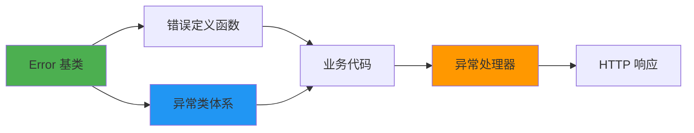
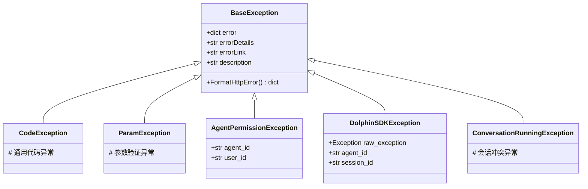
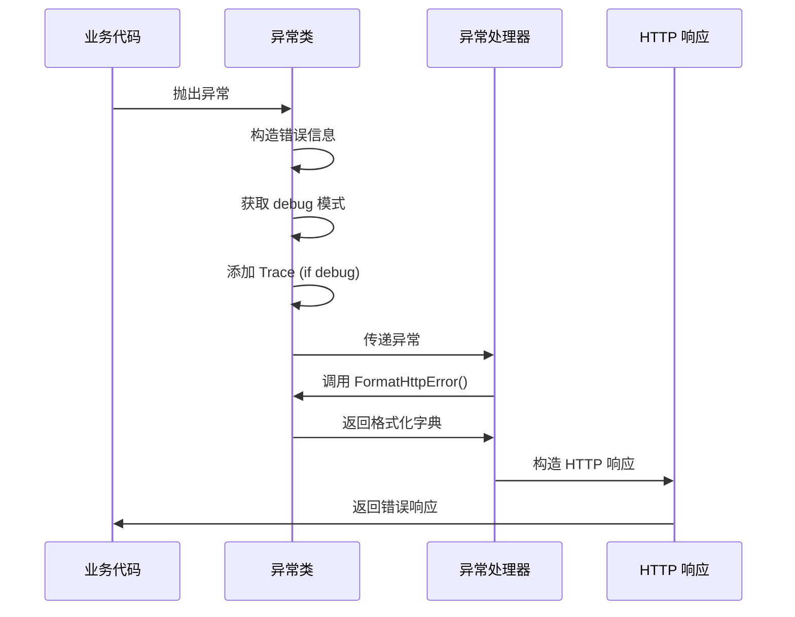

# 错误和异常系统

## 概述

Agent-Executor 的错误和异常系统提供了统一的错误处理机制，包含清晰的错误定义和异常类体系。

## 架构设计

### 核心组件



### 目录结构

```
app/common/
├── errors/                          # 错误定义包
│   ├── error.py                     # Error 基类
│   ├── common_errors.py             # 通用错误定义
│   ├── external_errors.py           # 外部服务错误定义
│   ├── file_errors.py               # 文件错误定义
│   ├── function_errors.py           # 函数错误定义
│   └── __init__.py                  # 统一导出
└── exceptions/                      # 异常类包
    ├── base_exception.py            # 基础异常类
    ├── code_exception.py            # 代码异常
    ├── param_exception.py           # 参数异常
    ├── agent_permission_exception.py # 权限异常
    ├── dolphin_sdk_exception.py     # Dolphin SDK 异常
    ├── conversation_running_exception.py # 会话运行异常
    └── __init__.py                  # 统一导出
```

## 使用指南

### 1. 错误定义（Error Definition）

错误定义函数返回包含错误信息的字典：

```python
from app.common.errors.common_errors import ParamError
from app.common.config import Config

# 创建错误定义
error = ParamError(debug_mode=Config.is_debug_mode())

# 错误字典结构
{
    "ErrorCode": "AgentExecutor.BadRequest.ParamError",
    "Description": "Parameter error!",
    "Solution": "Please check your parameter again.",
    "Trace": "..."  # 仅在 debug 模式下包含
}
```

#### 可用的错误定义函数

| 函数名 | 错误代码 | 用途 |
|--------|----------|------|
| `ParamError()` | `AgentExecutor.BadRequest.ParamError` | 参数验证失败 |
| `AgentPermissionError()` | `AgentExecutor.Forbidden.PermissionError` | 权限不足 |
| `ConversationRunningError()` | `AgentExecutor.ConflictError.ConversationRunning` | 会话冲突 |
| `DolphinSDKModelError()` | `AgentExecutor.DolphinSDKException.ModelExecption` | 模型错误 |
| `DolphinSDKSkillError()` | `AgentExecutor.DolphinSDKException.SkillExecption` | 技能错误 |
| `DolphinSDKBaseError()` | `AgentExecutor.DolphinSDKException.BaseExecption` | SDK 基础错误 |
| `AgentExecutor_ExternalServiceError()` | `AgentExecutor.InternalError.ExternalServiceError` | 外部服务错误 |
| `AgentExecutor_File_ParseError()` | `AgentExecutor.InternalError.ParseFileError` | 文件解析错误 |
| `AgentExecutor_Function_CodeError()` | `AgentExecutor.InternalError.ParseCodeError` | 代码解析错误 |
| `AgentExecutor_Function_InputError()` | `AgentExecutor.InternalError.RunCodeError` | 输入参数错误 |
| `AgentExecutor_Function_RunError()` | `AgentExecutor.InternalError.RunCodeError` | 代码运行错误 |
| `AgentExecutor_Function_OutputError()` | `AgentExecutor.InternalError.RunCodeError` | 输出格式错误 |

### 2. 异常类（Exception Classes）

异常类用于在代码中抛出和捕获错误：

```python
from app.common.exceptions import ParamException

# 抛出参数异常
raise ParamException(errorDetails="Invalid user_id parameter")

# 带链接的异常
raise ParamException(
    errorDetails="Invalid user_id parameter",
    errorLink="https://docs.example.com/api/errors#param-error"
)
```

#### 异常类继承关系



#### 可用的异常类

| 异常类 | 用途 | 示例 |
|--------|------|------|
| `CodeException` | 通用代码异常 | `CodeException(error_dict, "详细信息")` |
| `ParamException` | 参数验证失败 | `ParamException(errorDetails="Invalid param")` |
| `AgentPermissionException` | 权限不足 | `AgentPermissionException(agent_id="123", user_id="456")` |
| `DolphinSDKException` | Dolphin SDK 错误 | `DolphinSDKException(raw_exc, agent_id, session_id)` |
| `ConversationRunningException` | 会话冲突 | `ConversationRunningException(errorDetails="Busy")` |

### 3. 调试模式（Debug Mode）

调试模式通过 `Config.is_debug_mode()` 控制，在调试模式下：
- 错误字典自动包含 `Trace` 字段
- 追踪信息包含完整的堆栈跟踪
- 便于开发和故障排查

```python
# 非调试模式响应
{
    "description": "Parameter error!",
    "error_code": "AgentExecutor.BadRequest.ParamError",
    "error_details": "Invalid user_id parameter",
    "error_link": "",
    "solution": "Please check your parameter again."
}

# 调试模式响应（额外包含 trace 字段）
{
    "description": "Parameter error!",
    "error_code": "AgentExecutor.BadRequest.ParamError",
    "error_details": "Invalid user_id parameter",
    "error_link": "",
    "solution": "Please check your parameter again.",
    "trace": "Traceback (most recent call last):\n  File \"app/router/...\", line 42, in run_agent\n..."
}
```

## 使用示例

### 示例 1：参数验证

```python
from app.common.exceptions import ParamException

def validate_user_id(user_id: str):
    if not user_id or len(user_id) < 3:
        raise ParamException(errorDetails="user_id must be at least 3 characters")
```

### 示例 2：外部服务调用

```python
from app.common.errors import CodeException
from app.common.errors.external_errors import ExternalServiceError
from app.common.config import Config


async def call_external_service():
    try:
        response = await http_client.get(url)
        if response.status != 200:
            raise CodeException(
                error=ExternalServiceError(
                    debug_mode=Config.is_debug_mode()
                ),
                errorDetails=f"Service returned {response.status}"
            )
    except Exception as e:
        raise CodeException(
            error=ExternalServiceError(
                debug_mode=Config.is_debug_mode()
            ),
            errorDetails=str(e)
        )
```

### 示例 3：权限检查

```python
from app.common.exceptions import AgentPermissionException

async def check_agent_permission(agent_id: str, user_id: str):
    if not await has_permission(agent_id, user_id):
        raise AgentPermissionException(
            agent_id=agent_id,
            user_id=user_id
        )
```

### 示例 4：Dolphin SDK 异常包装

```python
from app.common.exceptions import DolphinSDKException
from DolphinLanguageSDK.exceptions import ModelException

try:
    result = await dolphin_executor.run(agent_context)
except ModelException as e:
    raise DolphinSDKException(
        raw_exception=e,
        agent_id="agent_123",
        session_id="session_456",
        user_id="user_789"
    )
```

## 异常处理流程



## 最佳实践

### ✅ 推荐做法

1. **使用异常类而不是直接使用错误字典**
   ```python
   # 推荐
   raise ParamException(errorDetails="Invalid parameter")

   # 不推荐
   raise CodeException(ParamError(), "Invalid parameter")
   ```

2. **提供详细的错误信息**
   ```python
   # 好
   raise ParamException(errorDetails="user_id must be a valid UUID")

   # 不好
   raise ParamException(errorDetails="Invalid input")
   ```

3. **在异常链中保留上下文**
   ```python
   try:
       await external_service.call()
   except Exception as e:
       raise CodeException(
           error=AgentExecutor_ExternalServiceError(
               debug_mode=Config.is_debug_mode()
           ),
           errorDetails=f"Failed to call service: {str(e)}"
       )
   ```

4. **使用配置的 debug 模式**
   ```python
   # 推荐
   error = ParamError(debug_mode=Config.is_debug_mode())

   # 不推荐
   error = ParamError(debug_mode=True)  # 硬编码
   ```

### ❌ 避免做法

1. **不要在生产环境硬编码 debug 模式**
2. **不要吞没异常而不记录日志**
3. **不要在错误消息中暴露敏感信息**
4. **不要使用通用的错误消息**

## 错误代码规范

错误代码格式：`服务名.类别.具体错误`

### 错误类别

- `BadRequest` - 客户端请求错误（4xx）
- `Forbidden` - 权限错误（403）
- `ConflictError` - 资源冲突（409）
- `InternalError` - 内部错误（5xx）
- `DolphinSDKException` - Dolphin SDK 相关错误

### 示例

```
AgentExecutor.BadRequest.ParamError
│            │          └─ 具体错误
│            └─ 错误类别
└─ 服务名
```

## 扩展指南

### 添加新的错误定义

1. 在相应的错误定义文件中添加函数：

```python
# app/common/errors/common_errors.py

def NewCustomError(debug_mode: bool = False) -> dict:
    """新的自定义错误"""
    return create_error(
        error_code="AgentExecutor.Category.NewCustomError",
        description=_l("Error description"),
        solution=_l("Suggested solution"),
        debug_mode=debug_mode,
    )
```

2. 在 `__init__.py` 中导出：

```python
from app.common.errors.common_errors import NewCustomError

__all__ = [
    # ...
    "NewCustomError",
]
```

### 添加新的异常类

1. 创建新的异常类文件：

```python
# app/common/exceptions/new_exception.py

from app.common.exceptions.base_exception import BaseException
from app.common.errors.common_errors import NewCustomError

class NewException(BaseException):
    """新的自定义异常"""

    def __init__(self, errorDetails: str = "", errorLink: str = ""):
        from app.common.config import Config
        debug_mode = Config.is_debug_mode()

        super().__init__(
            error=NewCustomError(debug_mode=debug_mode),
            errorDetails=errorDetails,
            errorLink=errorLink,
        )
```

2. 在 `__init__.py` 中导出：

```python
from app.common.exceptions.new_exception import NewException

__all__ = [
    # ...
    "NewException",
]
```

## 测试

测试文件位于 `test/common_test/errors_test/`：

```bash
# 运行所有错误和异常测试
python -m pytest test/common_test/errors_test/ -v

# 运行特定测试
python -m pytest test/common_test/errors_test/test_error.py -v
python -m pytest test/common_test/errors_test/test_exceptions.py -v
python -m pytest test/common_test/errors_test/test_error_definitions.py -v
```

## 参考资料

- [Error 基类源码](../../app/common/errors/error.py)
- [BaseException 源码](../../app/common/exceptions/base_exception.py)
- [异常处理器](../../app/router/exception_handler.py)
- [测试用例](../../test/common_test/errors_test/)
