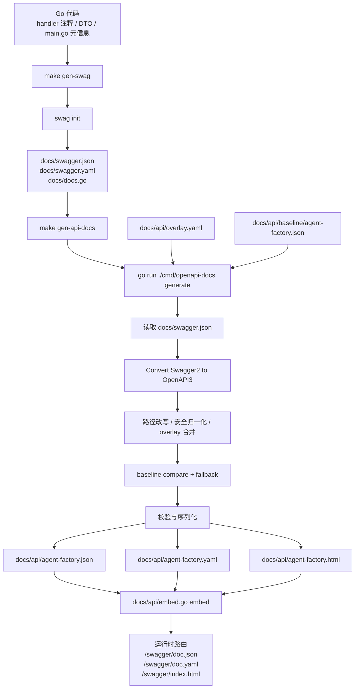

# Agent Factory Swagger / OpenAPI 文档链路梳理

## 1. 先说结论

这个仓库里的 API 文档不是一步生成的，而是两步：

1. `swag init`
   作用是把 Go 代码里的注释和类型，先生成一份 **Swagger 2.0 中间产物**。
2. `go run ./cmd/openapi-docs generate`
   作用是把这份中间产物继续加工成 **最终对外使用的 OpenAPI 3.0.2 文档**，并生成 Scalar 页面用的静态产物。

可以把它理解成：

- `swag` 负责“**从 Go 代码里采集文档信息**”
- `openapi-docs` 负责“**把采集结果整理成最终可发布版本**”

## 2. 整体链路图



## 3. 两步命令的职责总表

| 阶段 | 命令 | 核心职责 | 主要输入 | 主要输出 |
| --- | --- | --- | --- | --- |
| 第 1 步 | `make gen-swag` | 从 Go 代码生成 Swagger 2.0 中间产物 | `main.go` 注释、handler 注释、DTO/VO 类型 | `docs/swagger.json`、`docs/swagger.yaml`、`docs/docs.go` |
| 第 2 步 | `make gen-api-docs` | 把 Swagger 2.0 中间产物加工成最终 OpenAPI 3.0.2 产物 | `docs/swagger.json`、`docs/api/overlay.yaml`、`docs/api/baseline/agent-factory.json` | `docs/api/agent-factory.json`、`docs/api/agent-factory.yaml`、`docs/api/agent-factory.html` |
| 对比 | `make compare-api-docs` | 只生成 compare report，不写最终文档 | 同第 2 步 | `test_out/openapi_compare_report.md` |
| 校验 | `make validate-api-docs` | 校验最终产物是否合法、数量是否符合预期 | `docs/api/agent-factory.json`、`docs/api/agent-factory.html` | 控制台输出 + 退出码 |

## 4. 第一步：`swag` 的原理、输入、输出

### 4.1 命令是什么

`Makefile` 中对应的是：

```makefile
gen-swag:
	$(SWAG_CMD) init -g main.go -o docs --parseDependency
```

其中：

- `SWAG_CMD := go run github.com/swaggo/swag/cmd/swag@v1.16.6`
- 实际执行的是 `swag init`

### 4.2 `swag` 在这个仓库里的工作原理

`swag` 本质上是一个 **Go 注释驱动的文档提取器**。  
它会扫描 Go 代码中的 Swagger 风格注释，然后把这些注释和关联的 Go 类型转成 Swagger 2.0 文档。

在这个仓库里，它主要依赖两类输入：

1. **全局文档元信息**
   来自 [main.go](../../main.go) 顶部的注释，比如：
   - `@title`
   - `@version`
   - `@BasePath`
   - `@host`
   - `@securityDefinitions.apikey`

2. **接口级文档注释**
   来自各个 handler 方法上方的注释，比如：
   - [src/driveradapter/api/httphandler/agentconfighandler/create.go](../../src/driveradapter/api/httphandler/agentconfighandler/create.go)
   - [src/driveradapter/api/httphandler/agentconfighandler/detail.go](../../src/driveradapter/api/httphandler/agentconfighandler/detail.go)
   - [src/driveradapter/api/httphandler/agentconfighandler/update.go](../../src/driveradapter/api/httphandler/agentconfighandler/update.go)

这些注释里会声明：

- `@Summary`
- `@Description`
- `@Tags`
- `@Param`
- `@Success`
- `@Failure`
- `@Router`
- `@Security`

然后 `swag` 会继续追踪这些注释里引用到的 Go 类型，把字段结构也展开进文档。

### 4.3 `swag` 的输入是什么

| 输入类型 | 具体文件/来源 | 作用 |
| --- | --- | --- |
| 入口文件 | [main.go](../../main.go) | 提供全局 API 元信息 |
| handler 注释 | `src/driveradapter/api/httphandler/**` | 提供接口级说明 |
| 请求/响应结构体 | `src/driveradapter/api/rdto/**` | 生成 schema |
| 领域对象/枚举 | `src/domain/**` | 生成嵌套字段和 enum |
| 依赖包类型 | `--parseDependency` 打开后可扫描依赖 | 允许文档里引用依赖包中的类型 |

### 4.4 `swag` 命令参数在这里分别是什么意思

| 参数 | 含义 | 在本仓库中的作用 |
| --- | --- | --- |
| `init` | 执行生成 | 启动扫描和产物输出 |
| `-g main.go` | 指定 general API info 入口文件 | 告诉 `swag` 从 `main.go` 读取全局文档元信息 |
| `-o docs` | 指定输出目录 | 把中间产物写到 `docs/` |
| `--parseDependency` | 扫描依赖包类型 | 让 schema 可以引用项目外/依赖中的类型 |

### 4.5 `swag` 的输出是什么

| 输出文件 | 默认路径 | 类型 | 用途 |
| --- | --- | --- | --- |
| Swagger JSON | [docs/swagger.json](../swagger.json) | Swagger 2.0 | 第二步的核心输入 |
| Swagger YAML | [docs/swagger.yaml](../swagger.yaml) | Swagger 2.0 | 人工查看/排查用 |
| 生成的 Go 文件 | [docs/docs.go](../docs.go) | Go 源码 | `swag` 默认产物，记录同源文档内容 |

### 4.6 `docs/docs.go` 在当前链路里是什么角色

它是 `swag init` 的默认伴生产物，但在当前这套链路里：

- **第二步 `openapi-docs generate` 直接读取的是 `docs/swagger.json`**
- 当前仓库里搜索不到业务代码直接 import `docs` 包来提供运行时文档

所以更准确地说：

- `docs/docs.go` 是 `swag` 生成链路的一部分
- 但 **不是当前最终对外文档的直接输入源**

## 5. 第二步：`openapi-docs generate` 的原理、输入、输出

### 5.1 命令是什么

`Makefile` 中对应的是：

```makefile
gen-api-docs: gen-swag
	$(OPENAPI_DOCS_CMD) generate
```

其中：

- `OPENAPI_DOCS_CMD := go run ./cmd/openapi-docs`
- 实际执行的是 `go run ./cmd/openapi-docs generate`

### 5.2 这一步的本质

这一步不是“再扫一次 Go 代码”，而是：

1. **读取第一步生成出来的 Swagger 2.0 JSON**
2. **转成 OpenAPI 3.0.2**
3. **叠加仓库自己的后处理规则**
4. **产出最终对外版本**

也就是说，它是一个“**文档构建器 / 加工器**”，不是注释扫描器。

### 5.3 第二步命令入口文件

命令行入口在：

- [cmd/openapi-docs/main.go](../../cmd/openapi-docs/main.go)

真正的主流程在：

- [cmd/openapi-docs/generate.go](../../cmd/openapi-docs/generate.go)
- [internal/openapidoc/build.go](../../internal/openapidoc/build.go)

### 5.4 第二步的默认输入

这些默认值定义在 [cmd/openapi-docs/constants.go](../../cmd/openapi-docs/constants.go)。

| 参数 | 默认值 | 含义 |
| --- | --- | --- |
| `--swagger` | `docs/swagger.json` | 第一步产出的 Swagger 2.0 输入 |
| `--overlay` | `docs/api/overlay.yaml` | 手工覆盖层 |
| `--baseline` | `docs/api/baseline/agent-factory.json` | 比较基线与 fallback 来源 |
| `--out-json` | `docs/api/agent-factory.json` | 最终 OpenAPI JSON 输出 |
| `--out-yaml` | `docs/api/agent-factory.yaml` | 最终 OpenAPI YAML 输出 |
| `--out-html` | `docs/api/agent-factory.html` | 最终静态 HTML 输出 |
| `--report` | `test_out/openapi_compare_report.md` | compare report 输出 |

### 5.5 第二步真正读取哪些文件

| 输入文件 | 是否必需 | 作用 |
| --- | --- | --- |
| [docs/swagger.json](../swagger.json) | 是 | 原始 Swagger 2.0 文档输入 |
| [docs/api/overlay.yaml](./overlay.yaml) | 否 | 对生成结果做显式覆盖 |
| [docs/api/baseline/agent-factory.json](./baseline/agent-factory.json) | 否 | 用于 compare report 和缺失字段 fallback |

### 5.6 第二步的处理流程

主流程来自 [internal/openapidoc/build.go](../../internal/openapidoc/build.go) 的 `BuildArtifactsFromFiles`：

| 阶段 | 关键函数 | 输入 | 输出/作用 |
| --- | --- | --- | --- |
| 读取原始文档 | `os.ReadFile(opts.SwaggerPath)` | `docs/swagger.json` | 读入 Swagger 2.0 JSON |
| 格式转换 | `ConvertSwagger2ToOpenAPI3` | Swagger 2.0 JSON | OpenAPI 3 文档对象 |
| 路径重写 | `RewriteAgentFactoryPaths` | OpenAPI 3 文档 | 统一补 `/api/agent-factory` 前缀 |
| overlay 合并 | `MergeOverlay` | `overlay.yaml` + 当前文档 | 用手工规则覆盖生成结果 |
| 安全归一化 | `NormalizeSecurity` | 当前文档 | 统一安全定义名和接口级 security |
| 克隆最终稿 | `CloneOpenAPIDoc` | 当前文档 | 拿到一份可继续加工的 `finalDoc` |
| baseline 加载 | `LoadOpenAPIDocFile` | baseline JSON/YAML | 基线文档对象 |
| 差异报告 | `BuildComparisonReport` | generatedDoc + baselineDoc | 生成 compare report 文本 |
| baseline fallback | `MergeMissingFromBaseline` | finalDoc + baselineDoc | 只补缺失字段，不覆盖已有字段 |
| 归一化 | `NormalizePathParameters`、`NormalizeOperationIDs`、`NormalizeSecurity` | finalDoc | 修正 path 参数、重复 operationId、安全配置 |
| 校验 | `ValidateOpenAPI` | finalDoc | 用 `kin-openapi` 校验最终文档 |
| 序列化 | `MarshalOpenAPIJSON` / `MarshalOpenAPIYAML` | finalDoc | 生成 JSON / YAML |
| HTML 生成 | `RenderScalarStaticHTML` | final JSON | 生成静态 Scalar HTML |

### 5.7 第二步的输出是什么

| 输出文件 | 默认路径 | 说明 |
| --- | --- | --- |
| 最终 JSON | [docs/api/agent-factory.json](./agent-factory.json) | 最终 OpenAPI 3.0.2 文档 |
| 最终 YAML | [docs/api/agent-factory.yaml](./agent-factory.yaml) | 同上，YAML 版 |
| 静态 HTML | [docs/api/agent-factory.html](./agent-factory.html) | 便于直接打开的静态 Scalar 页面 |
| compare report | `test_out/openapi_compare_report.md` | 只有有 baseline 且报告非空时才会写出 |

### 5.8 第二步为什么需要 `overlay` 和 `baseline`

#### `overlay.yaml` 的作用

[docs/api/overlay.yaml](./overlay.yaml) 是“**显式覆盖层**”。

它适合放：

- `swag` 很难准确表达的文档元信息
- 想强制覆盖的说明
- 安全定义、tag group、examples 等生成链路外的补丁

特点是：

- 有写就覆盖
- 优先级高于 `swag` 原始结果

#### `baseline` 的作用

[docs/api/baseline/agent-factory.json](./baseline/agent-factory.json) 是“**对比基线 + 缺失字段兜底来源**”。

它有两个用途：

1. 生成 compare report，帮助看出“这次生成和当前接受结果有什么差异”
2. 在 `ApplyBaselineFallback=true` 时，把 **当前生成结果里缺失但基线里仍然存在的字段补回去**

特点是：

- 只补缺失，不强行覆盖已有内容
- 更像兜底，不是主数据源

## 6. 为什么这里要分两步，而不是只用 `swag`

原因可以简单理解为 4 点：

| 问题 | 只靠 `swag` 的局限 | 第二步怎么补上 |
| --- | --- | --- |
| 规范版本 | `swag` 产出的是 Swagger 2.0 | 第二步转成 OpenAPI 3.0.2 |
| 路径格式 | 生成结果未必完全符合本项目最终路径规范 | 第二步统一补 `/api/agent-factory` 前缀 |
| 文档补丁 | 某些文档信息不适合写在 Go 注释里 | 第二步合并 `overlay.yaml` |
| 平滑迁移 | 自动生成结果可能暂时和历史文档不完全一致 | 第二步用 baseline compare + fallback 兜底 |

所以：

- 第一步解决“**从代码提取**”
- 第二步解决“**整理成项目要求的最终格式**”

## 7. `compare` 和 `validate` 命令分别干什么

### 7.1 `compare`

命令入口：

- [cmd/openapi-docs/compare.go](../../cmd/openapi-docs/compare.go)

作用：

- 只生成差异报告
- 不写最终 JSON / YAML / HTML

输入：

- `docs/swagger.json`
- `docs/api/overlay.yaml`
- `docs/api/baseline/agent-factory.json`

输出：

- `test_out/openapi_compare_report.md`

### 7.2 `validate`

命令入口：

- [cmd/openapi-docs/validate.go](../../cmd/openapi-docs/validate.go)

作用：

- 校验最终 OpenAPI JSON 是否能被 `kin-openapi` 正常加载/校验
- 校验 path 数和 operation 数是否符合预期
- 校验静态 HTML 是否包含 Scalar 所需标记

默认输入：

| 参数 | 默认值 |
| --- | --- |
| `--input` | `docs/api/agent-factory.json` |
| `--html` | `docs/api/agent-factory.html` |
| `--expect-paths` | `55` |
| `--expect-ops` | `69` |

输出：

- 不产出新文件
- 主要输出到控制台
- 用进程退出码表示通过/失败

## 8. 运行时是怎么把文档暴露出来的

### 8.1 最终文档如何进二进制

[docs/api/embed.go](./embed.go) 用 `go:embed` 把这些文件打进二进制：

- `agent-factory.json`
- `agent-factory.yaml`
- `agent-factory.html`
- `favicon.png`

### 8.2 实际运行时路由在哪里

路由定义在：

- [src/infra/server/httpserver/router_swagger.go](../../src/infra/server/httpserver/router_swagger.go)

| 路由 | 作用 |
| --- | --- |
| `/swagger` | 302 到 `/swagger/index.html` |
| `/swagger/` | 302 到 `/swagger/index.html` |
| `/scalar` | 302 到 `/swagger/index.html` |
| `/scalar/` | 302 到 `/swagger/index.html` |
| `/swagger/index.html` | 返回运行时拼装的 Scalar 页面壳 |
| `/swagger/doc.json` | 返回最终 OpenAPI JSON，并动态改写 `servers` |
| `/swagger/doc.yaml` | 返回最终 OpenAPI YAML |
| `/swagger/favicon.png` | 返回图标 |

### 8.3 一个很容易混淆的点

虽然第二步会生成 [docs/api/agent-factory.html](./agent-factory.html)，并且它也被 embed 进去了，但：

- **当前运行时并不是直接把这个 embed 的 HTML 原样返回**
- 运行时实际返回的是 `router_swagger.go` 里的 `renderScalarPage(...)`

这意味着：

| 文件/逻辑 | 角色 |
| --- | --- |
| `docs/api/agent-factory.html` | 静态产物，便于分发/查看/对比 |
| `router_swagger.go` 的 `renderScalarPage` | 运行时真正返回给浏览器的 HTML 壳 |

### 8.4 为什么运行时不直接返回静态 HTML

因为运行时还做了一件事：

- 在 `/swagger/doc.json` 响应里，调用 `renderOpenAPIDocJSON`
- 用当前请求动态改写 `servers`

这样打开文档后：

- `Try it out` 默认会指向当前访问的 host/port
- 不需要把生成产物里的 `servers` 写死

## 9. 这条链路里每个文件大概属于哪一层

| 层级 | 代表文件 | 角色 |
| --- | --- | --- |
| 代码源头 | `main.go`、`src/driveradapter/api/httphandler/**` | 文档原始信息来源 |
| 第一步工具 | `swag init` | 从 Go 注释提取 Swagger 2.0 |
| 中间产物 | `docs/swagger.json`、`docs/swagger.yaml`、`docs/docs.go` | 中间层结果 |
| 第二步 CLI | `cmd/openapi-docs/*.go` | 命令入口与参数解析 |
| 第二步核心库 | `internal/openapidoc/*.go` | 转换、合并、校验、渲染 |
| 手工补丁 | `docs/api/overlay.yaml` | 强覆盖层 |
| 历史兜底 | `docs/api/baseline/*` | compare 与 fallback 基线 |
| 最终产物 | `docs/api/agent-factory.json`、`yaml`、`html` | 最终文档 |
| 二进制嵌入 | `docs/api/embed.go` | embed 到服务 |
| 运行时暴露 | `src/infra/server/httpserver/router_swagger.go` | 对外提供文档页面和 JSON/YAML |

## 10. 如果以后你要改文档，通常该动哪里

| 目标 | 优先修改位置 |
| --- | --- |
| 改接口摘要、参数、响应结构 | handler 注释 + DTO/schema 对应 Go 类型 |
| 改全局标题、版本、BasePath、安全定义 | `main.go` 顶部 swagger 注释 |
| 改 tag 分组、全局 description、强制覆盖某些字段 | `docs/api/overlay.yaml` |
| 观察生成结果与既有文档差异 | `make compare-api-docs` |
| 校验最终产物是否可发布 | `make validate-api-docs` |

一个常见判断原则是：

- **能从代码里表达，就优先放代码**
- **代码不适合表达，才放 overlay**
- **baseline 不是主编辑入口，它更像 compare/fallback 的辅助资产**

## 11. 常见误区

### 11.1 误区：`gen-api-docs` 会重新扫描 Go 代码

不是。  
真正扫描 Go 代码的是 `swag init`。  
`openapi-docs generate` 默认吃的是 `docs/swagger.json`。

### 11.2 误区：`docs/docs.go` 就是最终线上文档来源

不是。  
当前最终线上文档的主来源是：

- `docs/api/agent-factory.json`
- `docs/api/agent-factory.yaml`

运行时通过 `embed.go` 和 `router_swagger.go` 暴露它们。

### 11.3 误区：`baseline` 是主数据源

不是。  
主数据源还是：

1. Go 注释和类型
2. `swag` 生成的中间文档
3. `overlay.yaml`

`baseline` 更像：

- 差异比较对象
- 缺失字段兜底对象

### 11.4 误区：生成出来的 `agent-factory.html` 就是服务直接返回的页面

也不是。  
服务返回的是运行时拼出来的 HTML 壳，里面再去请求 `/swagger/doc.json`。

## 12. 最简理解版

如果你只想记住一句话，可以记这个：

> `gen-swag` 负责把 Go 代码变成 Swagger 2.0 中间产物；`gen-api-docs` 负责把中间产物加工成最终 OpenAPI 3 文档，并通过 embed + `/swagger/*` 路由对外提供。

再简化一点：

- `swag` = 从代码“抄文档”
- `openapi-docs` = 把抄出来的内容“整理成可发布版本”
